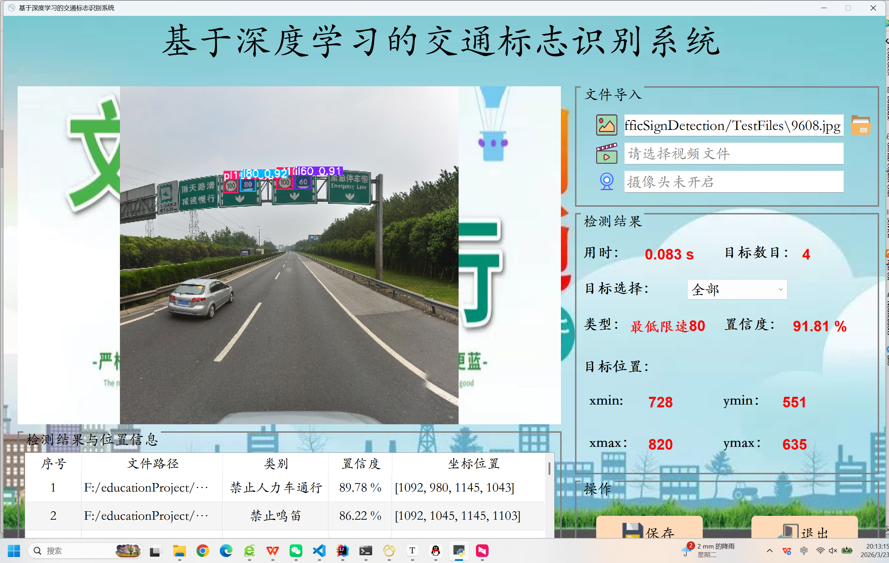
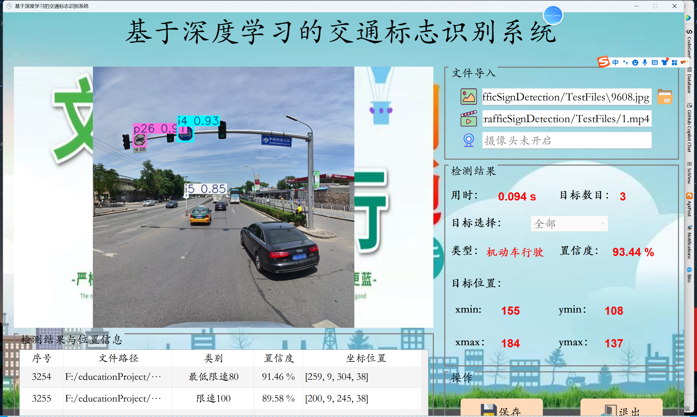
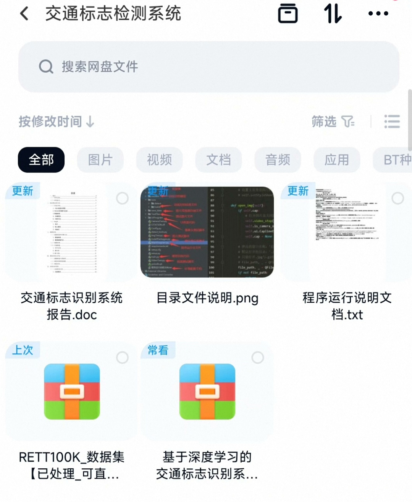
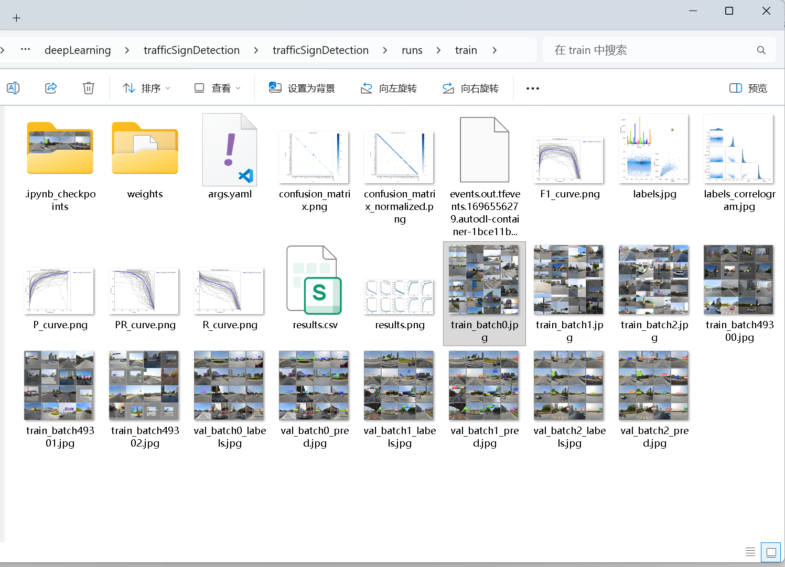
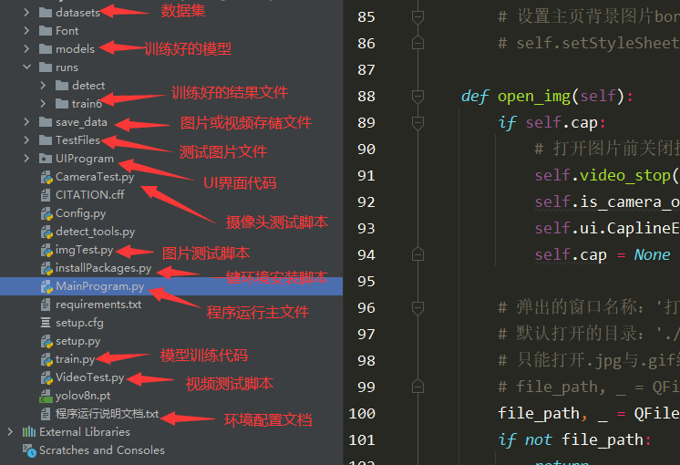

## 本项目完整源码是收费的  接毕业设计和论文

### 作者微信：grapro666 QQ：3642795578 (支持部署调试、支持代做毕设)

### 接javaweb、python、小程序、H5、APP、各种管理系统、单片机、嵌入式等开发

### 选题+开题报告+任务书+程序定制+安装调试+论文+答辩ppt

**博客地址：
[https://blog.csdn.net/2303_76227485/article/details/159437537](https://blog.csdn.net/2303_76227485/article/details/159437537)**

**视频演示：
[https://www.bilibili.com/video/BV1XzQoBCEDA/](https://www.bilibili.com/video/BV1XzQoBCEDA/)**

**毕业设计所有选题地址：
[https://github.com/ynwynw/allProject](https://github.com/ynwynw/allProject)**

## 基于python+深度学习+YOLOV8的交通标志识别系统(源代码+数据库+报告)
项目编号：269
## 一、系统介绍
### 1、用户：
- 在界面中选择各种图片，可以是自己在路边拍摄的图片，可以选择视频，可以调用摄像头，进行交通标志识别，检测速度快，检测精度高。
- 使用yolov8来进行模型训练
## 二、所用技术
python=3.9、opencv、PyQt5、torch1.9

## 三、环境介绍
基础环境 :IDEA/pycharm, python3.9

所有项目以及源代码本人均调试运行无问题 可支持远程调试运行

## 四、页面截图
### 1、用户：

## 五、部署教程
1. 使用IDEA/PyCharm导入trafficSignDetection项目，File>setting>Project>Python interpreter配置虚拟环境

2. 安装软件所需的依赖库（注意：输入命令前，命令行需先进入项目目录的路径下，不然会提示找不到文件）
方法一：【推荐】
直接运行installPackages.py一键安装第三方库的脚本。命令为：python installPackages.py
方法二: 运行下方命令
pip install -r requirements.txt -i https://pypi.tuna.tsinghua.edu.cn/simple

3. 按照以上两步环境配置完成后，直接运行MainProgram.py文件即可打开程序。命令为：python MainProgram.py

## 六、模型训练
【注意，由于数据集较大为10G,所以将代码部分与数据集分开上传了。请将数据集部分下载后放置到datasets目录中】
将文件【datasets/TrafficSignData/data.yaml】中train,val数据集的绝对路径改为自己项目数据集的绝对路径
train: F:\educationProject\deepLearning\trafficSignDetection\TrafficSignDetection\datasets\TrafficSignData\images\train
val: F:\educationProject\deepLearning\trafficSignDetection\TrafficSignDetection\datasets\TrafficSignData\images\val

然后运行train.py文件即可开始进行模型训练,训练结果会默认保存在runs/detect目录中。
其中runs/train是我已经训练好的结果文件，含模型与所有过程内容。
训练好的模型在runs/train/weights目录下，last.pt表示最后一轮结果的训练模型，best.pt表示训练中最好结果的训练模型。一般我们使用best.pt就行。
